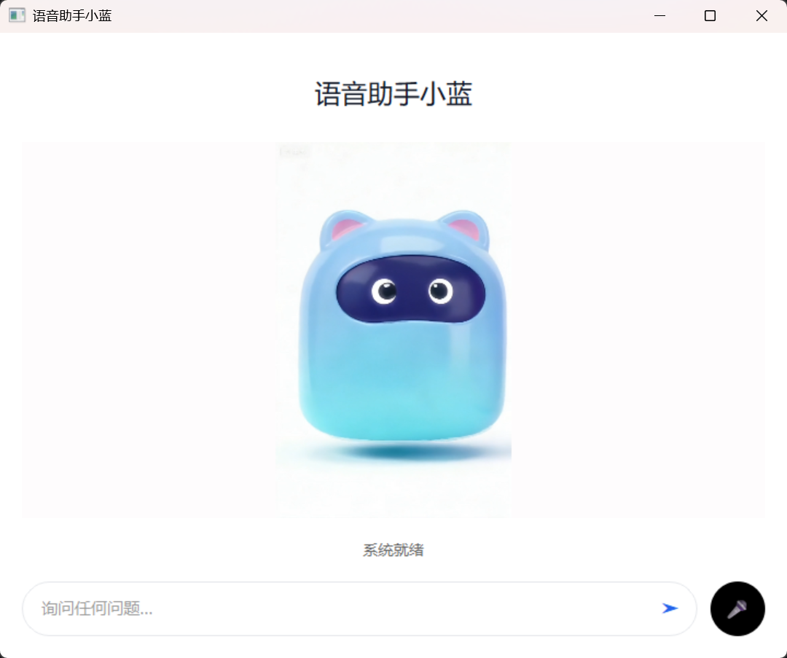

# 人机语音交互系统 (AI Voice Assistant)

这是一个基于 Python 开发的智能语音交互系统，集成了**语音唤醒**、**大模型意图识别**、**屏幕视觉理解**、**PC控制**和**ADB手机控制**等多项功能。

通过 "小蓝" 唤醒词，你可以使用自然语言控制电脑程序、操作手机APP、播放视频、搜索商品、发送微信消息，甚至让 AI 帮你总结屏幕内容或撰写 Word 文档。

## ✨ 核心功能

*   **🎙️ 智能语音唤醒**: 采用 Picovoice Porcupine 引擎，支持离线唤醒词 "小蓝"。
*   **🧠 大模型意图识别**: 集成 **阿里云通义千问 (Qwen)** 大模型，精准理解自然语言指令，不再局限于死板的关键词。
*   **👁️ 屏幕视觉理解**: 集成 **Qwen-VL** 视觉模型，支持 "总结当前屏幕内容" 和 "翻译当前界面"。
*   **🖥️ 现代化图形界面**: 基于 PySide6 开发的沉浸式 GUI，支持动态视频背景、实时字幕显示和可视化交互。
    
    

*   **💻 电脑深度控制**:
    *   打开应用程序 (记事本、浏览器、画图等)
    *   系统信息查询 (时间、日期、CPU/内存状态)
    *   **B站视频播放**: "帮我在B站找个猫咪视频"
    *   **淘宝商品搜索**: "在淘宝搜一下机械键盘"
    *   **音乐控制**: 播放/暂停/切歌 (网易云音乐等)
    *   **文档写作**: "帮我写一篇关于环保的文章" (自动生成 Word 文档)
    *   **微信消息**: "用微信告诉老妈我今晚回家吃饭"
*   **📱 手机全能控制 (ADB)**:
    *   应用管理: 打开/关闭 微信、抖音、支付宝等主流应用
    *   系统操作: 截屏、返回、回到桌面、锁屏/亮屏、音量调节
    *   滑动操作: 模拟手机上滑/下滑 (刷短视频神器)

## 🛠️ 技术栈

*   **语言**: Python 3.10+
*   **语音识别 (ASR)**: 百度语音 API
*   **语音合成 (TTS)**: 百度语音 API
*   **大语言模型 (LLM)**: 阿里云通义千问 (Qwen-Turbo/Plus)
*   **多模态模型 (VL)**: 阿里云通义千问 VL (Qwen-VL)
*   **语音唤醒**: Picovoice Porcupine
*   **手机控制**: Android Debug Bridge (ADB)
*   **图形界面**: PySide6 (Qt for Python)
*   **其他库**: `pygame` (音频播放), `pyautogui` (截屏), `python-docx` (文档生成)

## 🚀 快速开始

### 1. 环境准备

确保已安装 Python 3.10 或更高版本，并配置好 pip 源。
若需使用手机控制功能，请确保电脑已安装 [Android SDK Platform Tools (ADB)](https://developer.android.com/studio/releases/platform-tools) 并配置到环境变量。

### 2. 安装依赖

```bash
pip install -r requirements.txt
```

### 3. 配置 API 密钥

本项目依赖多个云服务 API，请先申请相关密钥：
*   **百度智能云**: [语音技术 (ASR/TTS)](https://ai.baidu.com/tech/speech)
*   **阿里云百炼**: [通义千问 (LLM/VL)](https://bailian.console.aliyun.com/)
*   **Picovoice**: [Porcupine (Wake Word)](https://console.picovoice.ai/)

复制配置文件模板并重命名为 `.env`：

```bash
cp .env.example .env
# 或者在 Windows 下手动重命名
```

编辑 `.env` 文件，填入你的 API 密钥：

```ini
# Baidu Speech (ASR/TTS)
BAIDU_API_KEY=你的百度API_KEY
BAIDU_SECRET_KEY=你的百度SECRET_KEY

# Wake Word (Picovoice)
PICOVOICE_ACCESS_KEY=你的Picovoice_AccessKey

# Aliyun Qwen (LLM & VL)
ALI_API_KEY=你的阿里云API_KEY
```

### 4. 运行程序

#### 方式一：命令行模式 (CLI)
```bash
python main.py
```

#### 方式二：图形界面模式 (GUI)
```bash
python ui.py
```

等待终端或界面显示 **"正在等待唤醒..."** 后，对着麦克风说 **"小蓝"** 即可唤醒助手。

## 🗣️ 指令示例

唤醒后（听到 "我在" 或提示音后），你可以试着说：

*   **通用指令**:
    *   "现在几点了？"
    *   "退出系统"

*   **应用控制**:
    *   "帮我打开网易云音乐"
    *   "打开浏览器访问百度"

*   **高级功能**:
    *   "帮我在B站上找关于Python教程的视频"
    *   "在淘宝看看最新的iPhone价格"
    *   "给张三发个微信，说我明天早上9点开会"
    *   "帮我写一份关于年度工作总结的报告"

*   **视觉功能**:
    *   "帮我总结一下当前屏幕的内容"
    *   "翻译一下屏幕上的英文"

*   **手机控制 (需连接手机)**:
    *   "打开手机抖音"
    *   "手机上滑" (刷下一个视频)
    *   "手机截屏"
    
*   **🌐 远程控制 (多设备联动)**:
    *   在第二台电脑运行 `remote_server.py`
    *   本机可通过 `remote_client.py` 发送指令控制对方：
        *   打开/关闭程序
        *   调节音量/锁屏/关机
        *   远程搜索/打开网页

## 📂 项目结构

```
数字语言处理/
├── main.py              # 主程序入口 (CLI版本)
├── ui.py                # 图形界面入口 (GUI版本)
├── remote_server.py     # 远程控制服务端 (需在被控机运行)
├── remote_client.py     # 远程控制客户端 (集成库)
├── LLM.py               # 大模型意图识别模块
├── LLM_VL.py            # 视觉理解模块 (屏幕总结/翻译)
├── ASR.py               # 语音识别模块
├── TTS.py               # 语音合成模块
├── WeChat.py            # 微信自动化模块
├── taobao.py            # 淘宝搜索模块
├── video.py             # 视频播放模块
├── music.py             # 音乐控制模块
├── word.py              # Word文档生成模块
├── voice_wake_word/     # 语音唤醒模型文件
├── .env                 # 配置文件 (需自行创建)
├── requirements.txt     # 依赖列表
└── Instruction.txt      # LLM 指令提示词模板
```

## ⚠️ 注意事项

1.  **Windows 系统**: 本项目主要在 Windows 10/11 环境下开发和测试，部分自动化操作 (如 `pyautogui` 和路径格式) 可能不兼容 Linux/Mac。
2.  **麦克风权限**: 请确保 Python 拥有麦克风录音权限。
3.  **手机连接**: 使用手机控制功能时，手机需开启 **USB调试** 模式，并授权电脑连接。
4.  **API 配额**: 请留意各云服务 API 的免费额度，超出后可能会产生费用。

## 📄 License

MIT License
